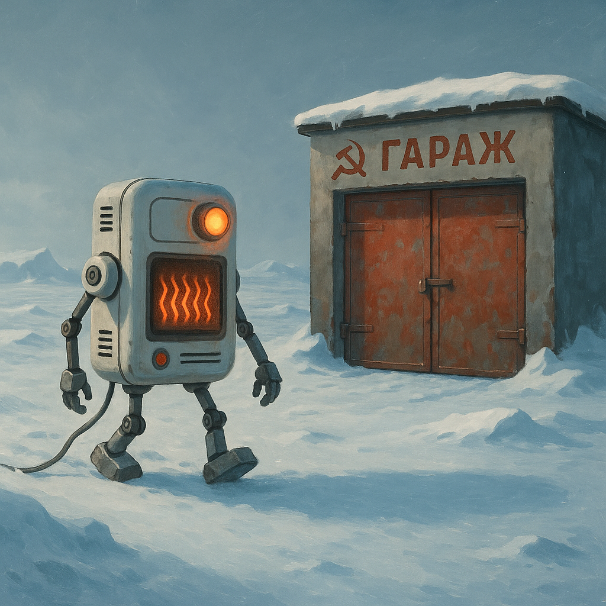
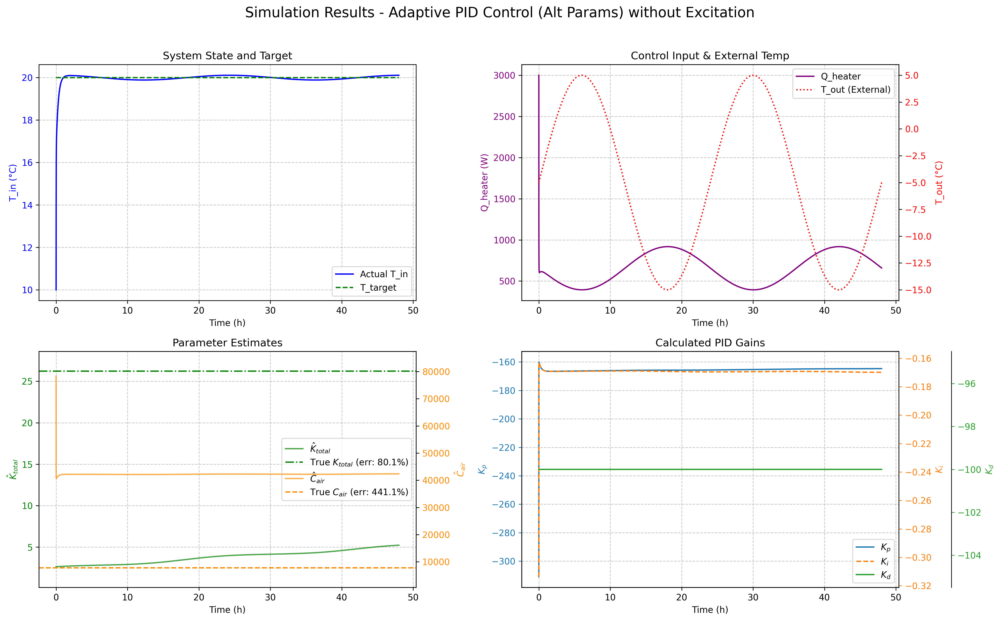
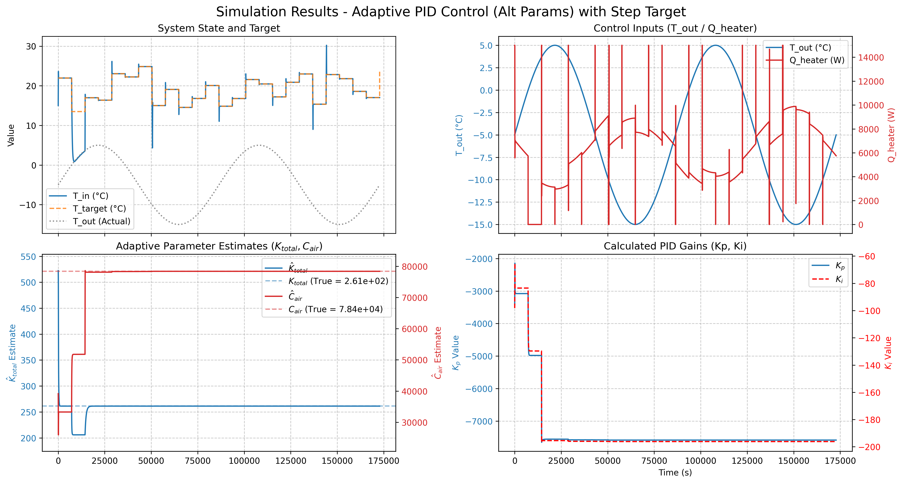

1 задача 
расскажать про адаптивное управление в робототехнике и поделиться философией

2 для кого
лонг ориентирован на инженеров, в первую очередь: робототехника, гейдев, электротехника, но форма подачи легкая, так что в целом на широкую публику

3 почему будет интересно
да мало вообще кто знает об этой технике, а еще тут много шуток

4 с чем уйдет человек
с базовым представлением о том что такое адаптивное управление и парой вопросов о людях и жизни на подумать

# Почему роботу не обязательно знать правду, чтобы делать свою работу

## Или как я пытался обогреть виртуальный гараж и случайно наткнулся на философию робототехники

Всё началось с того, что мой коллега купил гараж. «Как бы его эффективно отапливать?»
— спросил он меня за кофе. И я, как типичный инженер, вместо того чтобы посоветовать
купить обогреватель помощнее, решил построить математическую модель. Знаете, как
в том анекдоте: «Сколько программистов нужно, чтобы вкрутить лампочку? Ни одного
— это аппаратная проблема». Только у меня получилось наоборот — я превратил
аппаратную проблему в программную.

### Когда дрон встречает ветер
Но прежде чем рассказать про мой эпический провал-квест с виртуальным гаражом, давайте поговорим о дронах и ветре.

Представьте: группа инженеров месяцами настраивает новенький квадрокоптер. В
лаборатории он летает идеально — «зависни в этой точке», «пролети по квадратному маршруту» — выполняет всё с точностью до миллиметра, как швейцарские часы. Инженеры довольны, начальство в восторге, премии уже почти в кармане. А потом кто-то открывает окно.
И тут начинается цирк. Легкий сквозняк (не говоря уже о настоящем ветре) сносит дрон вбок. Он пытается компенсировать отклонение, но не понимает, что происходит. В его математической модели мира ветра просто не существует. Это как если бы вы всю жизнь жили в теплице, а потом вышли на улицу в бурю — «Что это за невидимая сила толкает меня?!»

### Адаптивное управление: когда незнание — сила
Тут на сцену выходит адаптивное управление — одна из самых крутых концепций в
робототехнике. Идея простая: если робот не знает всех параметров окружающего мира,
пусть учится на ходу.

Работает это примерно так: 
1. Робот предсказывает: «Если я поеду прямо, через секунду
буду вот здесь» 
2. Через секунду проверяет: «Хм, я оказался левее. Наверное, дует
ветер справа» 
3. Обновляет свою модель мира: «Окей, буду учитывать ветер силой X»
4. Повторяет, пока не научится ездить нормально.
Технически это реализуется через сравнение предсказанного состояния с реальным
и корректировку оценок неизвестных параметров. В случае с ветром робот может
использовать разницу между ожидаемой и реальной позицией для оценки силы и
направления ветра, даже не имея анемометра (датчик ветра).

### Магия в действии: дрон-неудачник против коварного Ветра
Давайте посмотрим, как эта магия работает, на конкретном подопытном.

Герой нашего романа — маленький дрон, который умеет летать только влево-вправо. Его великая миссия — висеть в точке ноль и не отсвечивать. Обозначим его позицию как $x$, скорость — $v$, а ускорение — $a$. Управлять мы будем, как завещал классик теории управления Понтрягин, — задавая ему боковое ускорение $u$.

**Сцена 1: Идеальный мир в лаборатории**
В тишине и безветрии лаборатории всё просто. Физика для дрона описывается одной фразой: «куда сказали, туда и ускоряюсь». Для тех, кто любит погорячее, вот формула: $a = u$. То есть реальное ускорение дрона $a$ в точности равно нашему управляющему ускорению $u$.
Чтобы заставить его висеть на месте, мы даём ему простейший «мозг» (ПД-регулятор), девиз которого: «Унесло вправо? Толкай влево!».
$$ u = -k_p x - k_d v $$
Тут $x$ — это позиция дрона, а $v$ — его скорость. $k_p$ и $k_d$ — это просто ручки «силы пинка», которые мы настраиваем. 

Чем сильнее дрона отнесло в сторону и чем больше его скорость, тем сильнее он тянемся в противоположную сторону. То есть если дрона унесло на расстояние до соседнего магазина, возвращаться он будет с ускорением межгалактической ракеты. Ну, а при малых отклонениях едва качнется в сторону цели. 

После пары колебаний, как студент после бессонной ночи, дрон находит равновесие и замирает в нуле. Успех!

**Сцена 2: Внезапный выход на улицу**
И тут на сцену выходит злодей — коварный боковой Ветер. Он создает своё собственное ускорение $w$, о силе которого мы понятия не имеем. Уравнение мира становится сложнее:
$$ a = u + w $$
То есть общее ускорение дрона теперь — результат нашего управления и пинка от Ветра. 
Наш старый контроллер с его наивным «толкай-обратно» впадает в панику. Он честно пытается вернуть дрон в ноль, но Ветер дует постоянно. В итоге дрон не висит в центре, а позорно застревает где-то сбоку, находя хрупкий баланс между командой «домой!» и настойчивым «уходи!» от Ветра. Миссия провалена.

**Сцена 3: Апгрейд мозга, или Адаптация 50-го уровня (года)**
Что делать? Прокачать нашему дрону мозги! Научим его не слепо бороться с последствиями, а понимать и предсказывать действия врага.

1.  **Заводим «дневник наблюдений»**: Дрон создаёт у себя в памяти переменную $\hat{w}$. Это его личная догадка, его гипотеза о том, какой силы этот наглый Ветер. Изначально полагаем $\hat{w}=0$.
2.  **Новый план действий**: Теперь его логика хитрее: «Я буду делать всё, как раньше, НО заранее дам упреждающего пинка в сторону, противоположную той, откуда, как я *думаю*, дует Ветер».
    $$ u = -k_p x - k_d v - \hat{w} $$
    Этот $\hat{w}$ в конце — и есть наш контрудар.
3.  **Закон адаптации (самое-самое интересное)**: Как дрону понять, что его гипотеза о ветре — чушь? Он постоянно сверяется со своим «детектором неудачи» — специальной величиной $s = v + x$. Если этот детектор не равен нулю, значит, что-то идёт не так, и пора пересматривать свои взгляды на жизнь (и на ветер). А если он равен нулю, значит его позиция $x$ и его скорость $v$ равны нулю, а мы этого и добивались. Есть тут еще небольшая вероятность, что позиция и скорость противоположны друг другу и равны по силе как гопота на стрелке, но это несильно нас беспокоит. 

    Правило обновления гениально в своей простоте. Вместо того чтобы менять свою догадку непрерывно, наш цифровой дрон делает это шажками, например, каждые 20 миллисекунд. На каждом шаге он смотрит на свой «детектор неудачи» и немного подкручивает свою гипотезу о ветре:

    $$ \hat{w}_{\text{новая}} = \hat{w}_{\text{старая}} + \gamma \cdot s $$
    
    или, если расписать $s$:
    
    $$ \hat{w}_{\text{новая}} = \hat{w}_{\text{старая}} + \gamma \cdot (v + x) $$

    Здесь $\gamma$ (гамма) — это уже не скорость, а маленький коэффициент, который можно назвать «шагом обучения» или «уровнем доверчивости» дрона к показаниям своего детектора.

    **Что это значит на человеческом?**
    Если «детектор неудачи» $s$ кричит, что дрона уносит вправо (и позиция $x$, и скорость $v$ положительны), формула говорит: «Эй, твоя догадка о ветре, дующем вправо, была слишком оптимистичной! Думай сильнее!». Дрон тут же увеличивает свою оценку $\hat{w}$. В следующий миг его упреждающий пинок $-\hat{w}$ становится мощнее, и он эффективнее борется с Ветром.
    Этот процесс самокопания и обучения продолжается, пока гипотеза $\hat{w}$ не станет почти точной копией реального ветра $w$. В этот момент «детектор неудачи» замолкает, оценка перестает меняться. Дрон гордо висит в точке ноль, а Ветер в бессильной ярости обдувает его, не в силах сдвинуть. Более того, после короткого периода обучения дрон имеет достаточно точное представление о силе ветра и компенсирует его с самурайской точностью и скоростью. Занавес.

### Мой виртуальный гараж и кризис истины
Вернёмся к моему гаражу. Я построил симуляцию системы отопления с неизвестными
параметрами: теплопроводность стен (спойлер: старые гаражи — это термос наоборот)
и постоянно меняющаяся внешняя температура.

Запустил адаптивный контроллер. Задача: поддерживать 20°C внутри. И знаете что?
Он справился! Температура держалась как приклеенная. Я уже было обрадовался, но
потом заглянул в оценки параметров…

Пройдемся по графикам:
1.  график показывает, что температура едва колеблется вокруг целевого значения в 20 градусов;
2.  обогреватель в точности попадает в пики уличной температуры;
3.  оцениваемые параметры абсолютно мимо кассы!
4.  параметры ПИД-регулятора как-то перестраиваются, не очень важно как, самое важное — третий график!

Контроллер в одном параметре ошибался на 80%, а в другом на 400%! В покер с такой предсказательной моделью я бы точно не стал играть... 

Однако это был момент озарения. Робот может прекрасно выполнять свою задачу, имея
совершенно неверное представление о мире. Он как тот студент на экзамене, который
решил задачу правильно, но по совершенно бредовой формуле, которую сам же и
придумал.

### Математика наблюдений (или почему GPS врёт, но довозит)
В теории управления есть красивая концепция. Любая система описывается уравнениями:
$$ \dot{x} = Ax + Bu $$

Где $x$ — реальное состояние (позиция, скорость), $u$ — управление (газ, тормоз), $y$ — наши
наблюдения (показания спидометра).

Состояние меняется в зависимости от того, где мы, и еще нашего управления.

$$ y = Cx $$
А видим мы... Что-то мы видим.

Фишка в том, что мы почти никогда не видим полное состояние системы. Едете на
машине? Спидометр показывает скорость, но не пройденный путь. Полное состояние системы — это пройденный путь и скорость $x = \begin{pmatrix} s \\ v \end{pmatrix}$. Наблюдение — это «обрезанное» состояние. 

$$ y = C x  = \begin{pmatrix} 0 & 0 \\ 0 & 1 \end{pmatrix} \begin{pmatrix} s \\ v \end{pmatrix} = \begin{pmatrix} 0 \\ v \end{pmatrix}$$
То есть из полного вектора состояния $\begin{pmatrix} s - \text{пройденный путь} \\ v - \text{скорость}\end{pmatrix}$ в результате матричного умножения у нас остается только скорость. Машина не знает, где она, она знает, как быстро. 

Робототехники решают эту проблему разными способами. Самый простой — интегрировать скорость, чтобы получить путь. Но любой, кто пробовал это делать, знает: ошибки накапливаются быстрее, чем долги по кредитке. Через час езды ваш робот будет думать, что он в соседнем городе.

Поэтому используют фильтры Калмана, частичные наблюдатели и другую математическую магию. И часто эти методы дают неточную, но достаточную для работы картину мира.

### Философия робота: миров нет, есть только сенсоры

Тут я сделал ещё один шаг в кроличью нору. А что вообще такое «истинное состояние»?
Робот никогда не видит мир — он видит только показания сенсоров. Для него нет
«машины» или «стены» — есть паттерны в данных с лидара, числа с энкодеров, пиксели
с камеры.

Мы, люди, делаем то же самое. Никто никогда не видел «силу» или «энергию» — мы
видим, как вещи двигаются, и придумываем концепции для объяснения. Вся физика —
это попытка найти паттерны в наших ощущениях и спрогнозировать будущие ощущения.

### Практический дзен: как заставить робота выучить правду

Помните мой контроллер с неверными параметрами? Я всё-таки заставил его выучить
правильные значения. Секрет оказался в хаосе — когда я сделал внешние условия
абсолютно случайными, контроллеру пришлось найти истинные параметры, чтобы
адаптироваться максимально быстро.

Посмотрим на графики:
1. я очень быстро меняю целевую температуру, обогреватель не сразу, но подстраивается;
2. обогреватель иногда психует и выдает максимум мощности, но в целом следит за погодой;
3. параметры довольно быстро подстроились под правильные значения; 
4. параметры ПИД-регулятора как-то перестраивались.

Это как учить нейросеть — на простых примерах она может выучить неправильные
паттерны, которые случайно работают. Но на разнообразных данных приходится учить
настоящие закономерности.

В робототехнике это называется «персистентное возбуждение» — когда входные
сигналы достаточно разнообразны, чтобы «прощупать» все аспекты системы. Без него
робот может застрять в локальном минимуме понимания мира.

Увы, мы, люди, тоже не лишены этого. Мы тоже можем застрять в локальном минимуме идеологии. 

### Когда правда не нужна: уроки для роботов и людей

Главный вывод из всей этой истории: для достижения цели не всегда нужна абсолютная
истина. Мой виртуальный гараж отапливался отлично даже с неверными параметрами.
Робот-пылесос прекрасно убирает, не зная законов термодинамики. Автопилот Tesla
довозит до места, имея весьма приблизительное представление о намерениях других
водителей.

В робототехнике мы постоянно идём на компромиссы между точностью модели и
вычислительной эффективностью. Можно построить супер-пупер-мега-убер-точную модель мира, но
пока робот её просчитает, мир уже изменится. Поэтому часто лучше иметь простую,
немного неточную, но быструю модель.

### Что это значит для нас
Работая с роботами, я понял несколько вещей:
1. «Я не знаю» — это нормальный ответ. Роботы постоянно работают с неполной
информацией и неопределенностью. Байесовские фильтры буквально оперируют
вероятностями: «Я на 70% уверен, что стена там».
2. Некоторые вещи unknowable. Есть параметры, которые просто невозможно
точно определить из доступных наблюдений. И это ок — часто приближения
достаточно.
3. Цель важнее правды. Если робот выполняет задачу, какая разница, правильно
ли он понимает мир? Главное — результат.

Может, стоит и нам иногда быть немного больше похожими на роботов? Меньше спорить о вещах, которые невозможно проверить, и больше фокусироваться на достижении целей. В конце концов, если мой виртуальный контроллер может отапливать гараж с неверным пониманием теплопроводности, то и мы можем достигать своих целей, не зная ответов на все вопросы вселенной.

### P.S. 
Коллега в итоге купил обычный масляный обогреватель. Работает отлично, никакой
математики не требует. Но где в этом веселье? Уже обсуждаем, как будем собирать ему
умный дом с анализом данных!

