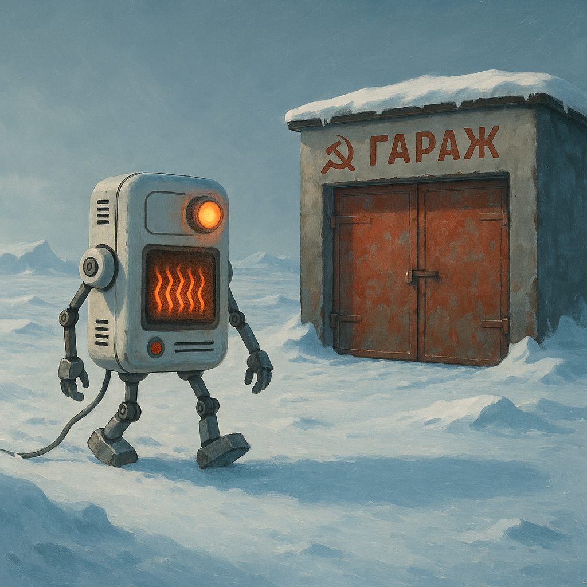

1 задача 
расскажать про адаптивное управление в робототехнике и поделиться философией

2 для кого
лонг ориентирован на инженеров, в первую очередь: робототехника, гейдев, электротехника, но форма подачи легкая, так что в целом на широкую публику

3 почему будет интересно
да мало вообще кто знает об этой технике, а еще тут много шуток

4 с чем уйдет человек
с базовым представлением о том что такое адаптивное управление и парой вопросов о людях и жизни на подумать

# Почему роботу не обязательно знать правду, чтобы делать свою работу

## Или как я пытался обогреть виртуальный гараж и случайно наткнулся на философию робототехники

Всё началось с того, что мой коллега купил гараж. «Как бы его эффективно отапливать?»
— спросил он меня за кофе. И я, как типичный инженер, вместо того чтобы посоветовать
купить обогреватель помощнее, решил построить математическую модель. Знаете, как
в том анекдоте: «Сколько программистов нужно, чтобы вкрутить лампочку? Ни одного
— это аппаратная проблема». Только у меня получилось наоборот — я превратил
аппаратную проблему в программную.

### Когда дрон встречает ветер
Но прежде чем рассказать про мой эпический провал-квест с виртуальным гаражом, давайте поговорим о дронах и ветре.

Представьте: группа инженеров месяцами настраивает новенький квадрокоптер. В
лаборатории он летает идеально — «зависни в этой точке», «пролети по квадратному маршруту» — выполняет всё с точностью до миллиметра, как швейцарские часы. Инженеры довольны, начальство в восторге, премии уже почти в кармане. А потом кто-то открывает окно.
И тут начинается цирк. Легкий сквозняк (не говоря уже о настоящем ветре) сносит дрон вбок. Он пытается компенсировать отклонение, но не понимает, что происходит. В его математической модели мира ветра просто не существует. Это как если бы вы всю жизнь жили в теплице, а потом вышли на улицу в бурю — «Что это за невидимая сила толкает меня?!»

### Адаптивное управление: когда незнание — сила
Тут на сцену выходит адаптивное управление — одна из самых крутых концепций в
робототехнике. Идея простая: если робот не знает всех параметров окружающего мира,
пусть учится на ходу.

Работает это примерно так: 
1. Робот предсказывает: «Если я поеду прямо, через секунду
буду вот здесь» 
2. Через секунду проверяет: «Хм, я оказался левее. Наверное, дует
ветер справа» 
3. Обновляет свою модель мира: «Окей, буду учитывать ветер силой X»
4. Повторяет, пока не научится ездить нормально.
Технически это реализуется через сравнение предсказанного состояния с реальным
и корректировку оценок неизвестных параметров. В случае с ветром робот может
использовать разницу между ожидаемой и реальной позицией для оценки силы и
направления ветра, даже не имея анемометра (датчик ветра). 