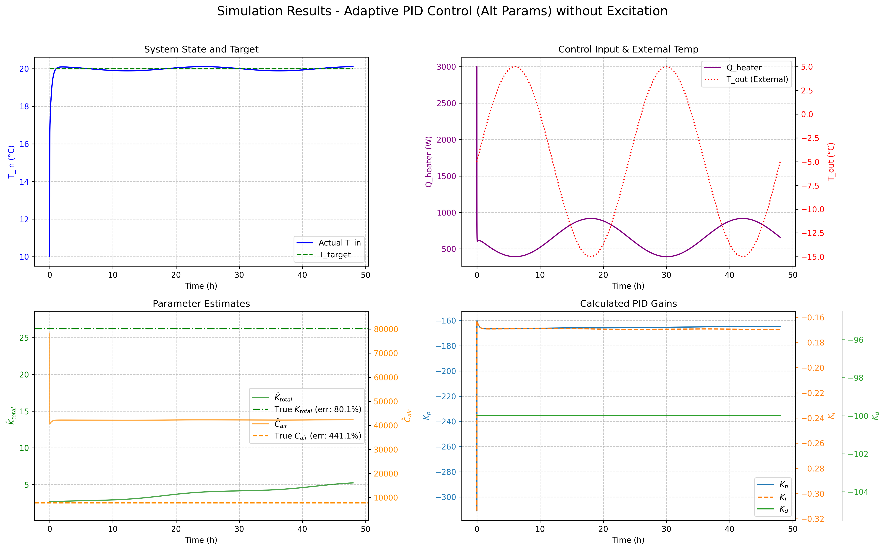

## Мой виртуальный гараж и кризис истины
Вернёмся к моему гаражу. Я построил симуляцию системы отопления с неизвестными
параметрами: теплопроводность стен (спойлер: старые гаражи — это термос наоборот)
и постоянно меняющаяся внешняя температура.

Запустил адаптивный контроллер. Задача: поддерживать 20°C внутри. И знаете что?
Он справился! Температура держалась как приклеенная. Я уже было обрадовался, но
потом заглянул в оценки параметров…

Пройдемся по графикам:
1.  график показывает, что температура едва колеблется вокруг целевого значения в 20 градусов;
2.  обогреватель в точности попадает в пики уличной температуры;
3.  оцениваемые параметры абсолютно мимо кассы!
4.  параметры ПИД-регулятора как-то перестраиваются, не очень важно как, самое важное — третий график!

Контроллер в одном параметре ошибался на 80%, а в другом на 400%! В покер с такой предсказательной моделью я бы точно не стал играть... 

Однако это был момент озарения. Робот может прекрасно выполнять свою задачу, имея
совершенно неверное представление о мире. Он как тот студент на экзамене, который
решил задачу правильно, но по совершенно бредовой формуле, которую сам же и
придумал. 