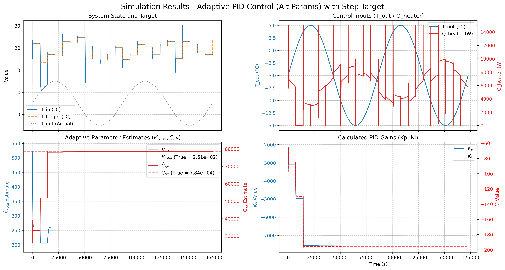

## Практический дзен: как заставить робота выучить правду

Помните мой контроллер с неверными параметрами? Я всё-таки заставил его выучить
правильные значения. Секрет оказался в хаосе — когда я сделал внешние условия
абсолютно случайными, контроллеру пришлось найти истинные параметры, чтобы
адаптироваться максимально быстро.

Посмотрим на графики:
1. я очень быстро меняю целевую температуру, обогреватель не сразу, но подстраивается;
2. обогреватель иногда психует и выдает максимум мощности, но в целом следит за погодой;
3. параметры довольно быстро подстроились под правильные значения; 
4. параметры ПИД-регулятора как-то перестраивались.

Это как учить нейросеть — на простых примерах она может выучить неправильные
паттерны, которые случайно работают. Но на разнообразных данных приходится учить
настоящие закономерности.

В робототехнике это называется «персистентное возбуждение» — когда входные
сигналы достаточно разнообразны, чтобы «прощупать» все аспекты системы. Без него
робот может застрять в локальном минимуме понимания мира.

Увы, мы, люди, тоже не лишены этого. Мы тоже можем застрять в локальном минимуме идеологии. 